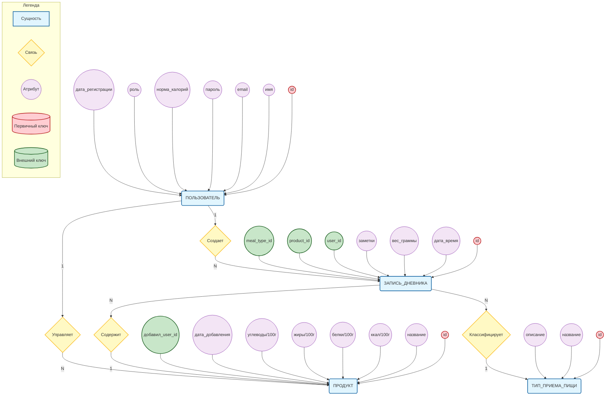

```mermaid 
    graph TD
    %% Стилизация
    classDef entity fill:#e1f5fe,stroke:#01579b,stroke-width:2px
    classDef relationship fill:#fff9c4,stroke:#fbc02d,stroke-width:2px,shape:diamond
    classDef attribute fill:#f3e5f5,stroke:#7b1fa2,stroke-width:1px
    classDef pk fill:#ffcdd2,stroke:#b71c1c,stroke-width:2px
    classDef fk fill:#c8e6c9,stroke:#1b5e20,stroke-width:2px
    
    %% Сущности (прямоугольники)
    П(ПОЛЬЗОВАТЕЛЬ):::entity
    Пр(ПРОДУКТ):::entity
    Т(ТИП_ПРИЕМА_ПИЩИ):::entity
    З(ЗАПИСЬ_ДНЕВНИКА):::entity
    
    %% Связи-ромбы
    С1{Создает}:::relationship
    С2{Содержит}:::relationship
    С3{Классифицирует}:::relationship
    С4{Управляет}:::relationship
    
    %% Атрибуты ПОЛЬЗОВАТЕЛЯ (овалы)
    А1((id)):::pk --> П
    А2((имя)):::attribute --> П
    А3((email)):::attribute --> П
    А4((пароль)):::attribute --> П
    А5((норма_калорий)):::attribute --> П
    А6((роль)):::attribute --> П
    А7((дата_регистрации)):::attribute --> П
    
    %% Атрибуты ПРОДУКТА
    А8((id)):::pk --> Пр
    А9((название)):::attribute --> Пр
    А10((ккал/100г)):::attribute --> Пр
    А11((белки/100г)):::attribute --> Пр
    А12((жиры/100г)):::attribute --> Пр
    А13((углеводы/100г)):::attribute --> Пр
    А14((дата_добавления)):::attribute --> Пр
    А15((добавил_user_id)):::fk --> Пр
    
    %% Атрибуты ТИПА_ПРИЕМА
    А16((id)):::pk --> Т
    А17((название)):::attribute --> Т
    А18((описание)):::attribute --> Т
    
    %% Атрибуты ЗАПИСИ
    А19((id)):::pk --> З
    А20((дата_время)):::attribute --> З
    А21((вес_граммы)):::attribute --> З
    А22((заметки)):::attribute --> З
    А23((user_id)):::fk --> З
    А24((product_id)):::fk --> З
    А25((meal_type_id)):::fk --> З
    
    %% Связи между сущностями и ромбами с кардинальностью
    П -- "1" --> С1
    С1 -- "N" --> З
    
    З -- "N" --> С2
    С2 -- "1" --> Пр
    
    З -- "N" --> С3
    С3 -- "1" --> Т
    
    П -- "1" --> С4
    С4 -- "N" --> Пр
    
    %% Легенда
    subgraph Легенда
        L1[Сущность]:::entity
        L2{Связь}:::relationship
        L3((Атрибут)):::attribute
        L4[(Первичный ключ)]:::pk
        L5[(Внешний ключ)]:::fk
    end
```