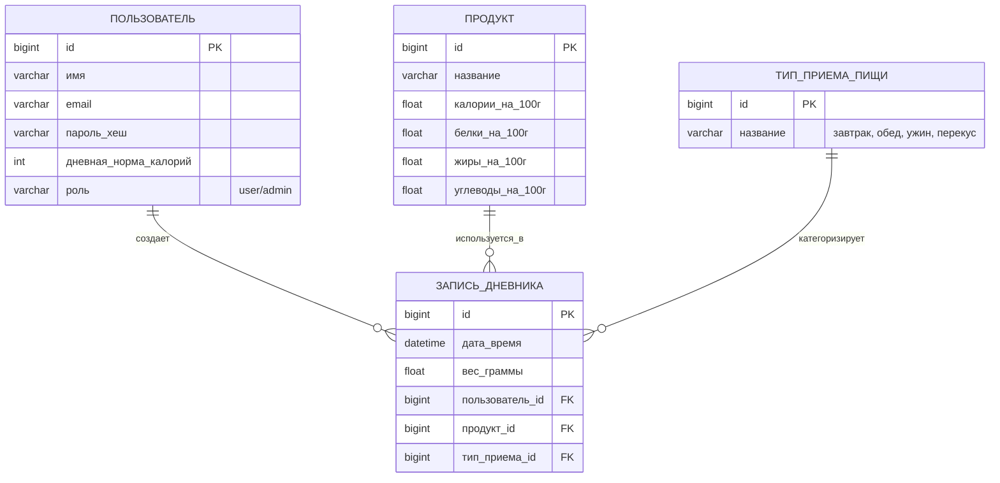

```mermaid 
    erDiagram
    ПОЛЬЗОВАТЕЛЬ ||--o{ ЗАПИСЬ_ДНЕВНИКА : создает
    ПРОДУКТ ||--o{ ЗАПИСЬ_ДНЕВНИКА : используется_в
    ТИП_ПРИЕМА_ПИЩИ ||--o{ ЗАПИСЬ_ДНЕВНИКА : категоризирует

    ПОЛЬЗОВАТЕЛЬ {
        bigint id PK
        varchar имя
        varchar email
        varchar пароль_хеш
        int дневная_норма_калорий
        varchar роль "user/admin"
    }

    ПРОДУКТ {
        bigint id PK
        varchar название
        float калории_на_100г
        float белки_на_100г
        float жиры_на_100г
        float углеводы_на_100г
    }

    ТИП_ПРИЕМА_ПИЩИ {
        bigint id PK
        varchar название "завтрак, обед, ужин, перекус"
    }

    ЗАПИСЬ_ДНЕВНИКА {
        bigint id PK
        datetime дата_время
        float вес_граммы
        bigint пользователь_id FK
        bigint продукт_id FK
        bigint тип_приема_id FK
    }
```